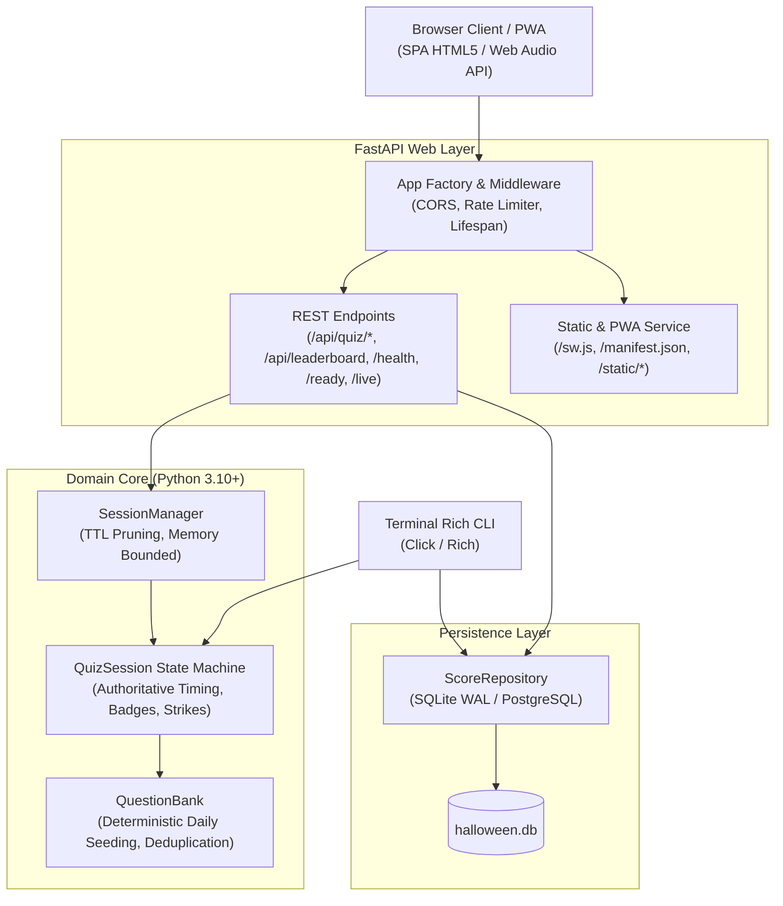

# System Architecture & Technical Design

## 1. High-Level Architecture Overview

The **Halloween Quiz** application is an asynchronous, high-performance web application and CLI trivia game designed for high concurrency, low latency, and zero external runtime dependencies for audio and assets.

---

## 2. Core Subsystems

### 2.1 Domain & State Machine (`src/halloween_quiz/core/`)
- **`models.py`**: Pydantic v2 schemas defining immutable core data contracts (`Question`, `QuizConfig`, `AnswerResult`, `ScoreRecord`, `Difficulty`, `GameMode`). Implements CSV/formula injection sanitization on player names.
- **`engine.py`**:
  - `QuestionBank`: Loads and validates trivia questions from JSON. Implements deterministic UTC-seeded pseudo-random selection for the global **Daily Haunt** mode (`select_daily_questions`).
  - `QuizSession`: Encapsulates an active quiz run. Server-authoritative elapsed timing (`_question_presented_at` monotonic timestamps) prevents client speed exploits. Evaluates deterministic criteria for badges and manages strike counters for Endless mode.
  - `SessionManager`: Thread-safe, in-memory session registry with TTL expiration (default 1 hour) and maximum session capacity bounds (1000 active sessions) to prevent memory exhaustion.
- **`storage.py`**:
  - `ScoreRepository`: Abstracted persistence supporting SQLite WAL (Write-Ahead Logging) and PostgreSQL (`DATABASE_URL`). Automatically runs non-destructive schema migrations (e.g. adding `mode` and `max_streak` columns).

### 2.2 Web Backend (`src/halloween_quiz/web/`)
- **`app.py`**: FastAPI application factory configuring security headers, safe CORS origins, structured logging, static file mounts, and graceful lifespan context managers.
- **`routes.py`**: Clean RESTful endpoints for quiz lifecycle (`/api/quiz/start`, `/api/quiz/{id}/answer`, `/api/quiz/{id}/timeout`, `/api/quiz/{id}`), daily challenge queries (`/api/daily`), category queries (`/api/categories`), and leaderboard operations.
- **`security.py`**: Sliding-window in-memory IP rate limiter protecting sensitive actions (15 quiz starts/minute, 60 actions/minute) and returning HTTP 429 when thresholds are exceeded.

### 2.3 Client Engine & Audio Synthesis (`src/halloween_quiz/web/static/`)
- **`app.js`**:
  - `SoundEngine`: Pure client-side audio player using HTML5 Audio with fallback procedural tone synthesizers built entirely on the **Web Audio API** (`OscillatorNode` / `GainNode`).
  - `HalloweenQuizApp`: Event-driven SPA controller managing DOM state, keyboard navigation (1-4, A-D, Enter, Escape), countdown timer rendering (50ms interval), achievement unlocks, and local storage persistence.
  - **PWA Service Worker Registration**: Registers `/sw.js` and handles browser `beforeinstallprompt` events for standalone installation.
  - **Web Share API**: Generates formatted ASCII survival cards with clipboard fallback.
- **`style.css`**: Accessible styling system with CSS custom properties, responsive media queries (360px, 390px, 768px, 880px, 1366px, 1920px), and `prefers-reduced-motion` suppression.

---

## 3. Anti-Cheat & Security Model

1. **Server-Authoritative Timing**:
   The server records monotonic timestamp `_question_presented_at` whenever a question is delivered. Upon answer submission, server elapsed time is computed. Client-reported `time_taken` is only accepted if it is within a plausible network tolerance window; otherwise, server elapsed time is strictly enforced.
2. **Deterministic Daily Sequence**:
   The Daily Haunt question set is generated by hashing the current UTC date string (`halloween-daily-YYYY-MM-DD-v2`). All players receive the exact same sequence regardless of timezone or client clock manipulation.
3. **Session Verification for Leaderboard**:
   High score entries require a valid, completed `session_id` to prevent arbitrary public injection of falsified high scores.
4. **Input Sanitization**:
   Player names have leading spreadsheet formula operators (`=`, `+`, `-`, `@`, `|`, `%`) stripped to prevent CSV injection vulnerabilities upon export.

---

## 4. Verification & Testing Strategy

- **Unit & Integration Tests** (`tests/test_api.py`, `tests/test_engine.py`, `tests/test_models.py`, `tests/test_storage.py`, `tests/test_cli.py`, `tests/test_production_features.py`):
  - 30 tests validating models, anti-cheat timing, rate limiting, probes, session pruning, and migrations.
- **Browser E2E Tests** (`tests/test_browser_e2e.py`):
  - 13 Playwright tests verifying full user gameplay, category selection guards, audio controls, keyboard shortcuts, settings modal, mastery modal, endless mode strikes HUD, and responsive layouts across 5 standard viewports (360px, 390px, 768px, 1366px, 1920px).
- **Static Analysis**:
  - Ruff (0 linting or formatting errors).
  - Mypy (strict type verification across 14 modules).
