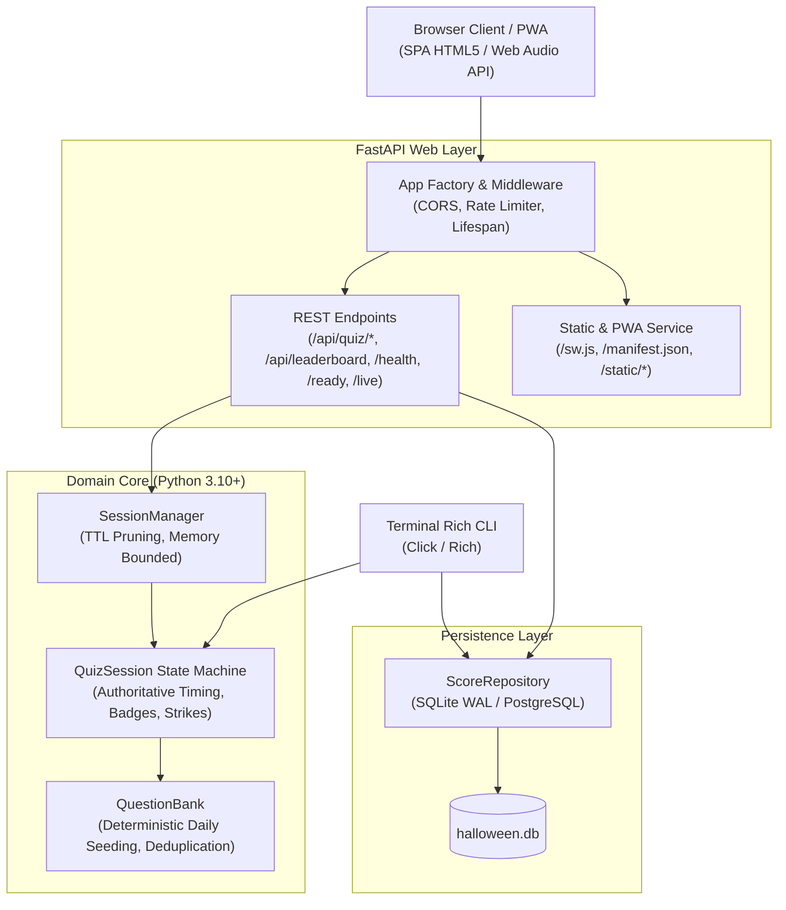
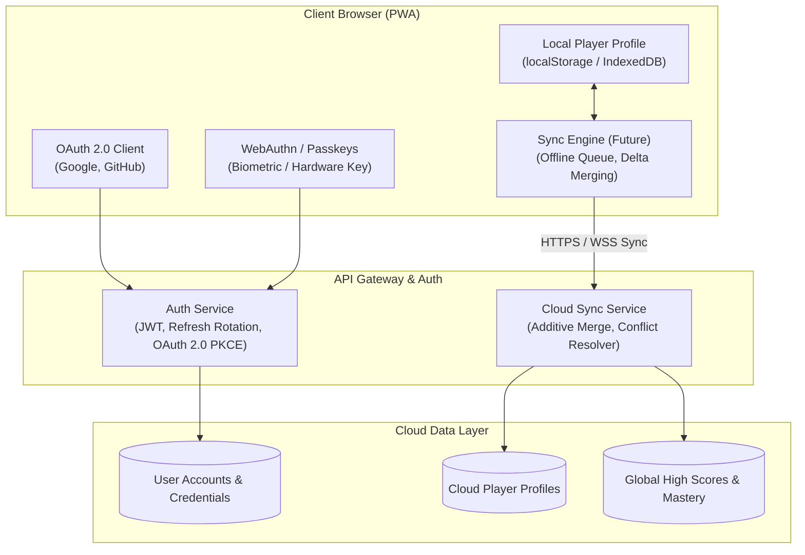

# System Architecture & Technical Design

## 1. High-Level Architecture Overview

The **Halloween Quiz / Spooky Master** application is an asynchronous, high-performance web application and CLI trivia game designed for high concurrency, low latency, zero external runtime dependencies for audio and assets, and an offline-capable PWA architecture.



---

## 2. Core Subsystems

### 2.1 Domain & State Machine (`src/halloween_quiz/core/`)
- **`models.py`**: Pydantic v2 schemas defining immutable core data contracts (`Question`, `QuizConfig`, `AnswerResult`, `ScoreRecord`, `Difficulty`, `GameMode`). Implements CSV/formula injection sanitization on player names.
- **`engine.py`**:
  - `QuestionBank`: Loads and validates trivia questions from JSON. Implements deterministic UTC-seeded pseudo-random selection for the global **Daily Haunt** mode (`select_daily_questions`).
  - `QuizSession`: Encapsulates an active quiz run. Server-authoritative elapsed timing (`_question_presented_at` monotonic timestamps) prevents client speed exploits. Evaluates deterministic criteria for badges and manages strike counters for Endless mode.
  - `SessionManager`: Thread-safe, in-memory session registry with TTL expiration (default 1 hour) and maximum session capacity bounds (1000 active sessions) to prevent memory exhaustion.
- **`storage.py`**:
  - `ScoreRepository`: Abstracted persistence supporting SQLite WAL (Write-Ahead Logging) and PostgreSQL (`DATABASE_URL`). Automatically runs non-destructive schema migrations (e.g. adding `mode` and `max_streak` columns).

### 2.2 Web Backend (`src/halloween_quiz/web/`)
- **`app.py`**: FastAPI application factory configuring security headers, safe CORS origins, structured logging, static file mounts, and graceful lifespan context managers.
- **`routes.py`**: Clean RESTful endpoints for quiz lifecycle (`/api/quiz/start`, `/api/quiz/{id}/answer`, `/api/quiz/{id}/timeout`, `/api/quiz/{id}`), daily challenge queries (`/api/daily`), category queries (`/api/categories`), and leaderboard operations.
- **`security.py`**: Sliding-window in-memory IP rate limiter protecting sensitive actions (15 quiz starts/minute, 60 actions/minute) and returning HTTP 429 when thresholds are exceeded.

---

## 3. Client Architecture & UX System (IMPLEMENTED NOW)

### 3.1 Local Player Profile & Seamless Migration
The client engine implements an authoritative local player profile stored under the key `spooky_player_profile`.
- **Profile Schema**:
  ```json
  {
    "profile_version": 1,
    "player_id": "c3a6e9d2-...",
    "nickname": "Ghost Hunter",
    "avatar_id": "pumpkin_hunter",
    "created_at": "2026-09-14T12:00:00.000Z",
    "updated_at": "2026-09-14T12:00:00.000Z",
    "stats": {
      "games_played": 0,
      "total_answered": 0,
      "total_correct": 0,
      "best_score": 0,
      "best_streak": 0,
      "preferred_mode": "classic"
    },
    "preferences": {
      "music_enabled": true,
      "music_volume": 0.25,
      "music_track": "haunted_mansion",
      "sfx_enabled": true,
      "sfx_volume": 0.60,
      "reduced_motion": false,
      "vibration": true
    }
  }
  ```
- **Seamless Upgrade Path**: On application initialization, the profile manager checks for legacy keys (`halloween_progress_v2`, `halloween_progress_v1`, `halloween_music_volume`, `halloween_sfx_volume`, `halloween_muted`, etc.). If legacy data is detected, it is immediately migrated into `spooky_player_profile` without resetting existing stats, achievements, or volume preferences.

### 3.2 Predefined Vector Illustrated Avatar System
To guarantee zero external CDN dependencies and instant rendering across any resolution, 8 SVG vector avatars are served directly from the canonical static directory (`/static/avatars/`):
1. **Pumpkin Hunter** (`pumpkin_hunter.svg`): Classic carved Jack-o'-lantern with glowing embers and rogue hood.
2. **Spectral Ghost** (`ghost.svg`): Ethereal floating phantom with wisping ectoplasm and soft cyan aura.
3. **Crimson Vampire** (`vampire.svg`): Victorian noble vampire with high-collared cape and blood-ruby brooch.
4. **Mystic Witch** (`witch.svg`): Pointed hat witch with enchanted amethyst glow and floating star dust.
5. **Crypt Skeleton** (`skeleton.svg`): Ancient skeletal warrior with glowing eye sockets.
6. **Grave Walker** (`zombie.svg`): Reanimated midnight wanderer with mossy green hue and spooky grin.
7. **Lunar Werewolf** (`werewolf.svg`): Fierce beast silhouette beneath a full moon with luminous eyes.
8. **Night Creature** (`night_bat.svg`): Winged gothic nocturnal gargoyle with amber gaze.

### 3.3 Audio Engine Hierarchy, Ducking & Centralized Settings
- **Audio Control Center**: Audio controls are strictly removed from the top navigation bar to maintain a minimal, clean header. All audio and ambience configuration is consolidated inside the Settings modal (`#modal-settings`).
- **Volume Hierarchy**:
  - Background Music / Ambience: `25%` baseline
  - UI Interaction clicks: `20%`
  - Timer Warning ticks: `25%`
  - Correct / Incorrect Feedback: `60%`
  - Achievement Unlock Fanfares: `65%`
  - Round Finish Fanfares: `70%`
- **Dynamic Ducking**: When feedback or fanfare sounds play, background ambience is ducked down to 35% of its set volume, smoothly returning to 100% over 600ms via `linearRampToValueAtTime`.
- **Track Selection**: Architecture supports switching between `haunted_mansion` (horror ambience loop) and `silent` (mute music, SFX only).

### 3.4 Interactive Category Selector Cards
- Fully interactive, pressable category cards replacing small chip pills.
- Visual hierarchy: Large category icon, clear name, question count, mastery percentage badge, and real-time category mastery progress bar.
- Selection indicator: Tactile checkmark badge (`✓` selected vs `○` unselected) with highlighted border glow.
- Accessibility: Keyboard navigable with Space / Enter to toggle, ARIA checkbox attributes (`role="checkbox"`, `aria-checked="true/false"`).

### 3.5 First-Launch Onboarding Flow
- Fast, focused onboarding modal displayed **only** on first launch when no local player profile and no legacy progress exist.
- Allows players to pick their starting avatar and nickname (with 4 suggested handles) or skip to the crypt.
- Completing onboarding writes the profile to `localStorage` and transitions seamlessly to the start screen. Subsequent visits immediately bypass onboarding.

---

## 4. Anti-Cheat & Security Model

1. **Server-Authoritative Timing**:
   The server records monotonic timestamp `_question_presented_at` whenever a question is delivered. Upon answer submission, server elapsed time is computed. Client-reported `time_taken` is only accepted if it is within a plausible network tolerance window; otherwise, server elapsed time is strictly enforced.
2. **Deterministic Daily Sequence**:
   The Daily Haunt question set is generated by hashing the current UTC date string (`halloween-daily-YYYY-MM-DD-v2`). All players receive the exact same sequence regardless of timezone or client clock manipulation.
3. **Session Verification for Leaderboard**:
   High score entries require a valid, completed `session_id` to prevent arbitrary public injection of falsified high scores.
4. **Input Sanitization**:
   Player names have leading spreadsheet formula operators (`=`, `+`, `-`, `@`, `|`, `%`) stripped to prevent CSV injection vulnerabilities upon export.

---

## 5. Future Cloud Synchronization & Authentication Architecture (DESIGNED FOR FUTURE IMPLEMENTATION)

> [!NOTE]
> The following section outlines the planned architecture for user authentication, cloud synchronization, and cross-device progression. This section is **DESIGNED FOR FUTURE IMPLEMENTATION** and describes the target state for Phases 2 and 3. The current production application operates in **Guest Mode (Phase 1)** with authoritative local profiles and SQLite WAL storage.



### 5.1 Authentication Strategy (OAuth 2.0 & WebAuthn)
1. **Zero-Friction Guest Mode First**:
   Players must never be forced to create an account to play. The application boots into Guest Mode immediately.
2. **Identity Providers**:
   - **OAuth 2.0 / OpenID Connect (OIDC)**: Support for Google, GitHub, and Apple Single Sign-On using authorization code flow with PKCE (Proof Key for Code Exchange).
   - **WebAuthn / Passkeys**: Support for biometric (Touch ID, Face ID, Windows Hello) and FIDO2 hardware keys, enabling passwordless authentication without email confirmation overhead.
3. **Token Management**:
   - Access tokens (short-lived JWTs, 15-minute expiry) stored in memory (never localStorage).
   - Refresh tokens (long-lived, 30-day expiry) stored in `HttpOnly`, `Secure`, `SameSite=Strict` cookies with automatic token rotation and replay detection.

### 5.2 Account Linking & Migration Flow
When an unauthenticated guest player decides to sign in or create an account:
1. Client passes the existing local `player_id` and full `spooky_player_profile` payload in the authentication handshake.
2. The server links the local profile to the newly created `user_id`.
3. If an existing cloud profile already exists for that user:
   - **Stats Merging**: Additive merge for `games_played`, `total_answered`, `total_correct`.
   - **High Scores & Streaks**: Maximum value taken (`Math.max(cloud.best_score, local.best_score)`).
   - **Achievements & Badges**: Set union of unlocked achievements.
   - **Preferences**: Last-Write-Wins (LWW) based on the `updated_at` ISO-8601 timestamp.
4. The resolved authoritative profile is returned to the client and written back to local storage.

### 5.3 Cloud Data Schema
```sql
-- Target relational schema for PostgreSQL / CockroachDB
CREATE TABLE users (
    id UUID PRIMARY KEY DEFAULT gen_random_uuid(),
    email VARCHAR(255) UNIQUE,
    created_at TIMESTAMPTZ NOT NULL DEFAULT NOW(),
    updated_at TIMESTAMPTZ NOT NULL DEFAULT NOW()
);

CREATE TABLE auth_identities (
    id UUID PRIMARY KEY DEFAULT gen_random_uuid(),
    user_id UUID NOT NULL REFERENCES users(id) ON DELETE CASCADE,
    provider VARCHAR(32) NOT NULL, -- 'google', 'github', 'webauthn'
    provider_user_id VARCHAR(255) NOT NULL,
    created_at TIMESTAMPTZ NOT NULL DEFAULT NOW(),
    UNIQUE(provider, provider_user_id)
);

CREATE TABLE player_profiles (
    user_id UUID PRIMARY KEY REFERENCES users(id) ON DELETE CASCADE,
    nickname VARCHAR(32) NOT NULL,
    avatar_id VARCHAR(32) NOT NULL DEFAULT 'pumpkin_hunter',
    stats JSONB NOT NULL DEFAULT '{}'::jsonb,
    preferences JSONB NOT NULL DEFAULT '{}'::jsonb,
    achievements JSONB NOT NULL DEFAULT '{}'::jsonb,
    mastery JSONB NOT NULL DEFAULT '{}'::jsonb,
    version INTEGER NOT NULL DEFAULT 1,
    updated_at TIMESTAMPTZ NOT NULL DEFAULT NOW()
);
```

### 5.4 Offline-First Synchronization Protocol
- **Queueing**: When offline, score updates and mastery achievements are enqueued in IndexedDB (`sync_outbox`).
- **Background Sync**: Uses the Service Worker `SyncManager` API (`sync` event) or triggers upon window `online` event.
- **Conflict Resolution**:
  - `stats`: Strictly monotonic accumulation (`cloud.stat += delta.stat`).
  - `preferences`: Last-Write-Wins based on client timestamp clamped to server received time.
  - `leaderboard`: Idempotent score ingestion using unique `session_id`.

### 5.5 Privacy & Compliance (GDPR / CCPA)
- **Data Minimization**: Only store necessary gameplay stats and public nicknames. No personal trackers or third-party advertising SDKs.
- **Account Deletion**: Provide a "Delete My Account & Cloud Data" button in Settings that invokes `DELETE /api/user/me`, cascading deletes across all tables within 30 days.
- **Data Portability**: Export profile and trivia history as JSON (`GET /api/user/me/export`).

### 5.6 Phased Implementation Roadmap
- **Phase 1: Local Profiles & UX Enhancement (COMPLETED - IMPLEMENTED NOW)**:
  Authoritative local profiles (`spooky_player_profile`), legacy storage migration, 8 SVG avatars, tactile category cards, onboarding modal, audio balancing & ducking, centralized settings.
- **Phase 2: Authentication & User Accounts (DESIGNED - NEXT)**:
  OAuth 2.0 PKCE and WebAuthn authentication service, JWT cookie sessions, guest account promotion endpoint.
- **Phase 3: Cloud Sync & Multi-Device (DESIGNED)**:
  Bi-directional cloud synchronization, conflict resolution, offline sync queue via Service Worker.
- **Phase 4: Social & Multiplayer (DESIGNED)**:
  Ghost runs, asynchronous friend challenges, global seasonal leagues, and clan mastery tournaments.

---

## 6. Verification & Quality Assurance

- **Backend & Core Unit Tests** (`pytest`):
  - 30 tests covering API endpoints, CLI features, engine state machine, deterministic Daily Haunt, anti-cheat timing, rate limiting, and SQLite/PostgreSQL migrations.
- **Browser End-to-End Tests** (`pytest tests/test_browser_e2e.py`):
  - 16 Playwright tests covering:
    1. Top navigation simplification (audio controls removed, only Brand, Progress, Leaderboard, Settings displayed).
    2. Centralized audio controls inside Settings modal (BGM toggle, track selector, music volume slider, SFX toggle, SFX slider, persistence).
    3. Category selector interactive cards (click selection, Space/Enter keyboard accessibility, check indicators, zero-category start guard).
    4. First-launch onboarding lifecycle (display on clean launch, avatar selection, nickname input, profile saving, suppression on reload).
    5. Legacy data migration (automatic upgrade of `halloween_progress_v2` and volumes into `spooky_player_profile` without data loss and skipping onboarding).
    6. Profile & Progress Dashboard modal (hero banner, avatar, nickname, tier badge, stats grid, 8 badges, 6 category mastery bars).
    7. Start screen avatar customization via shared drawer.
    8. Complete 5-question quiz round gameplay with HUD, keyboard shortcuts, feedback panels, review stats, and play again.
    9. Endless mode 3 strikes HUD and badge.
    10. Leaderboard modal difficulty tab switching.
    11. Responsive layout testing across 5 viewports (360x740, 390x844, 768x1024, 1366x768, 1920x1080) with zero horizontal overflow.
- **Static Analysis & Type Verification**:
  - `ruff check .`: 0 errors.
  - `mypy src`: 0 errors across 14 source files.
- **Operational Health**:
  - `/health`, `/live`, and `/ready` probes return HTTP 200 with operational metrics.
