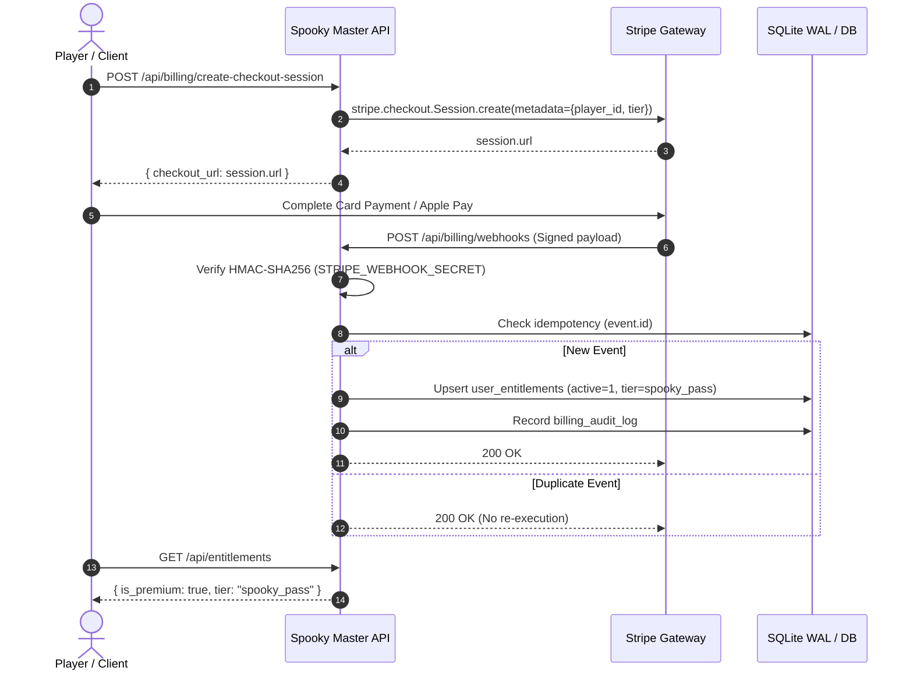

# Spooky Master — Monetization & Entitlement Architecture

**Version**: 1.0.0  
**Date**: September 2026  
**Status**: Target Production Specification  
**Governing Standard**: Strict Zero Pay-To-Win Fair Play  

---

## 1. Executive Summary & Product Gating Model

Spooky Master adopts a sustainable, fair-play freemium model. All competitive modes (Daily Haunt, Haunted Duels, and High Score Crypts) remain server-authoritative and 100% skill-based. No real-world currency or subscription can grant timer advantages, score multipliers, duel boosts, or artificial leaderboard inflation.

### Tier Entitlement Matrix

| Feature / Domain | Free Player | Spooky Master Pass ($4.99 One-Time) | Haunted VIP ($2.99 / Month) |
| :--- | :--- | :--- | :--- |
| **Core Halloween Trivia** | Full Access (100+ questions) | Full Access | Full Access |
| **Introductory Campaign** | Chapters 1–3 (18 stages) | All Chapters 1–6 (36 stages) | All Chapters 1–6 (36 stages) |
| **Atmospheric Themes** | Haunted Mansion | +4 Themes (Blood Moon, Phantom Forest, Neon Crypt, Midnight Graveyard) | All 5 Themes + Future Seasonal Themes |
| **Cosmetic Avatars** | 8 Base Illustrated Guises | +4 Exclusive Guises (Phantom King, Shadow Witch, Vampire Lord, Banshee) | All 12 Guises + VIP Crown Badge |
| **Advanced Trivia Packs** | Standard 6 Categories | +3 Expansion Packs (Cryptids, Cinema Masters, Global Folklore) | All Expansion Packs |
| **Ad Experience** | Interstitial Ad Placeholders (if enabled) | Ad-Free Guarantee | Ad-Free Guarantee |
| **Daily Haunt Economy** | Standard Diamond Rewards | +50 Bonus Daily Haunt Diamonds | +50 Bonus Daily Haunt Diamonds |
| **Ranked Leaderboards** | Server-Authoritative Fair Play | Server-Authoritative Fair Play | Golden VIP Hunter Flair (Cosmetic Only) |
| **Timer / Speed Multipliers** | Strict Fair Timing | Zero Timer Advantages | Zero Timer Advantages |
| **Competitive Fairness** | 100% Skill-Based | Zero Pay-To-Win | Zero Pay-To-Win |

---

## 2. Product Catalog & SKU Definitions

```json
[
  {
    "id": "spooky_pass_lifetime",
    "tier": "spooky_pass",
    "title": "Spooky Master Pass",
    "price_usd": 4.99,
    "billing_type": "one_time",
    "apple_product_id": "com.spookymaster.pass.lifetime",
    "google_product_id": "spooky_pass_lifetime",
    "stripe_price_id": "price_1SpookyPassLifetime001"
  },
  {
    "id": "haunted_vip_monthly",
    "tier": "haunted_vip",
    "title": "Haunted VIP Pass",
    "price_usd": 2.99,
    "billing_type": "recurring_monthly",
    "apple_product_id": "com.spookymaster.vip.monthly",
    "google_product_id": "haunted_vip_monthly",
    "stripe_price_id": "price_1HauntedVipMonthly001"
  }
]
```

---

## 3. Server-Authoritative Database Schema

Entitlements are persisted in SQLite (WAL mode) or PostgreSQL using the authoritative schema below:

```sql
CREATE TABLE IF NOT EXISTS user_entitlements (
    id INTEGER PRIMARY KEY AUTOINCREMENT,
    user_id TEXT NOT NULL,
    entitlement_tier TEXT NOT NULL CHECK (entitlement_tier IN ('free', 'spooky_pass', 'haunted_vip')),
    source TEXT NOT NULL CHECK (source IN ('stripe', 'apple_storekit', 'google_play', 'dev_override', 'promo')),
    external_customer_id TEXT,
    external_subscription_id TEXT,
    is_active INTEGER NOT NULL DEFAULT 1,
    expires_at TEXT, -- ISO8601 UTC timestamp; NULL for lifetime purchases
    idempotency_key TEXT UNIQUE,
    created_at TEXT NOT NULL DEFAULT (strftime('%Y-%m-%dT%H:%M:%fZ', 'now')),
    updated_at TEXT NOT NULL DEFAULT (strftime('%Y-%m-%dT%H:%M:%fZ', 'now'))
);

CREATE INDEX IF NOT EXISTS idx_entitlements_user ON user_entitlements (user_id);
CREATE INDEX IF NOT EXISTS idx_entitlements_active ON user_entitlements (is_active, expires_at);

CREATE TABLE IF NOT EXISTS billing_audit_log (
    id INTEGER PRIMARY KEY AUTOINCREMENT,
    event_id TEXT NOT NULL UNIQUE,
    provider TEXT NOT NULL,
    event_type TEXT NOT NULL,
    user_id TEXT,
    payload_json TEXT NOT NULL,
    processed_at TEXT NOT NULL DEFAULT (strftime('%Y-%m-%dT%H:%M:%fZ', 'now'))
);
```

---

## 4. Stripe Webhook & Checkout Integration

### 4.1. Architecture Diagram



### 4.2. Webhook Event Handlers

1. **`checkout.session.completed`**:
   - Verify `payment_status == 'paid'`.
   - Extract `client_reference_id` or `metadata.player_id`.
   - Update `user_entitlements`: set `entitlement_tier = 'spooky_pass'`, `source = 'stripe'`, `is_active = 1`.

2. **`customer.subscription.created` & `customer.subscription.updated`**:
   - Check subscription `status` (`active`, `trialing`, `past_due`, `canceled`).
   - Extract current period end timestamp (`current_period_end`).
   - Set `entitlement_tier = 'haunted_vip'`, `expires_at = timestamp`, `is_active = (status in ['active', 'trialing'])`.

3. **`customer.subscription.deleted`**:
   - Set `is_active = 0` on matching `external_subscription_id`.
   - Fall back to lifetime entitlement if player previously purchased Spooky Master Pass.

4. **`invoice.payment_succeeded`**:
   - Extend `expires_at` for recurring monthly billing cycles.

5. **`invoice.payment_failed`**:
   - Transition state to grace period (3 days) or deactivate entitlement after grace expires.

### 4.3. Security & Anti-Fraud Guardrails

- **Cryptographic Signature Verification**: Every incoming webhook payload must be validated using `stripe.Webhook.construct_event(payload, sig_header, STRIPE_WEBHOOK_SECRET)`. Invalid signatures return immediate HTTP 400 without touching storage.
- **Idempotent Execution**: SQLite WAL uniquely indexes `idempotency_key` (Stripe `event.id`). Duplicate events are acknowledged with HTTP 200 to satisfy webhook delivery guarantees without duplicate ledger writes.
- **Replay Protection**: Timestamps outside a 300-second drift tolerance are rejected.

---

## 5. Mobile App Store Receipt Validation (StoreKit 2 & Google Play)

### 5.1. Apple StoreKit 2 (iOS / macOS / Safari PWA)
- The client acquires JWS signed transaction records via StoreKit 2 (`Transaction.currentEntitlements`).
- Server validates JWS header against Apple's Root Certificate authority.
- `bundle_id == 'com.spookymaster.halloween'` and `environment == 'Production'` strictly enforced.
- Revocation reasons checked via Server-to-Server Notifications V2 (`DID_RENEW`, `EXPIRED`, `REVOKE`).

### 5.2. Google Play Billing (Android TWA / Play Store)
- Client receives purchase token from Google Play Billing library.
- Server invokes `androidpublisher.purchases.subscriptionsv2.get` using a secure Google Cloud service account key.
- Verifies package name `com.spookymaster.halloween`, subscription state `SUBSCRIPTION_STATE_ACTIVE`.
- Real-time developer notifications (RTDN) via Google Cloud Pub/Sub consume lifecycle events (`SUBSCRIPTION_PURCHASED`, `SUBSCRIPTION_RENEWED`, `SUBSCRIPTION_CANCELED`).

---

## 6. Safe Local Development Mode Isolation

To allow full integration testing of all entitlement states without real payment credentials, Spooky Master features an explicit test mode:

```bash
# .env (local development only)
ENVIRONMENT=development
DEV_PREMIUM_MODE=true
```

### Critical Isolation Invariants:
1. **Production Lock**: When `ENVIRONMENT=production`, `DEV_PREMIUM_MODE` is strictly ignored and forced to `False`.
2. **Endpoint Hardening**: The query parameter override `tier=spooky_pass` on `/api/entitlements` raises HTTP 403 Forbidden if `ENVIRONMENT == "production"`.
3. **No Phantom Records**: Test overrides operate strictly in-memory or in isolated test tables with explicit `source = 'dev_override'`. Production billing audit logs cannot be contaminated.

---

## 7. Strict Zero Pay-To-Win Architectural Guarantee

Under NO circumstances shall payment code, entitlement verifiers, or subscription workers:
- Modify question timers, base question points, speed bonus coefficients, or streak multipliers.
- Grant damage reduction or tiebreaker priority in Haunted Duels.
- Interfere with server-authoritative answer evaluation (`ScoringService.calculate_points`).
- Submit artificial high scores to the Crypt of High Scores.

Any pull request or patch that introduces score modifications or timer extensions linked to `is_premium` is architecturally invalid and will fail continuous integration checks.
