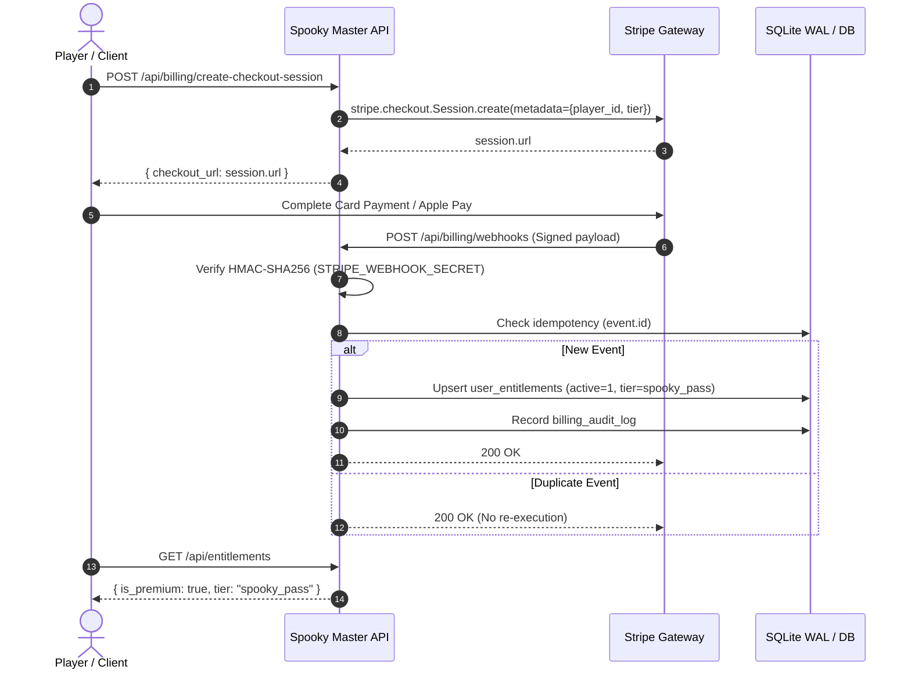

> [!IMPORTANT]
> **TARGET FUTURE SPECIFICATION — NOT CURRENTLY IMPLEMENTED IN PRODUCTION**
> Real-money billing gateways (Stripe Checkout, Apple StoreKit 2, Google Play Billing) and external receipt validation services documented herein represent future target architectural specifications. In the current release, entitlements are managed via durable SQLite storage (`user_entitlements` table) with guest state separation and non-production simulation modes. No live financial transactions, live storefront charges, or third-party webhooks are active.

# Spooky Master — Monetization & Entitlement Architecture

**Version**: 2.3.0  
**Date**: September 2026  
**Status**: Target Architecture & Hardened Implementation Specification  
**Governing Standard**: Strict Zero Pay-To-Win Fair Play (Policy A)  

---

## 1. Executive Summary & Product Gating Model

Spooky Master adopts a sustainable, fair-play freemium model. All competitive modes (Daily Haunt, Haunted Duels, and High Score Crypts) remain server-authoritative and 100% skill-based. Under **Policy A**, no real-world currency or subscription can grant timer advantages, score multipliers, duel boosts, artificial leaderboard inflation, or free diamond currency grants.

### Tier Entitlement Matrix (Policy A: Pure Zero Pay-To-Win)

| Feature / Domain | Free Player | Spooky Master Pass ($4.99 Proposed Config) | Haunted VIP ($2.99 / Mo Proposed Config) |
| :--- | :--- | :--- | :--- |
| **Core Halloween Trivia** | Full Access (100+ questions) | Full Access | Full Access |
| **Introductory Campaign** | Chapters 1–3 (18 stages) | All Chapters 1–6 (36 stages) | All Chapters 1–6 (36 stages) |
| **Atmospheric Themes** | Haunted Mansion | +4 Themes (Blood Moon, Phantom Forest, Neon Crypt, Midnight Graveyard) | All 5 Themes + Future Seasonal Themes |
| **Cosmetic Avatars** | 8 Base Illustrated Guises | +4 Exclusive Guises (Phantom King, Shadow Witch, Vampire Lord, Banshee) | All 12 Guises + VIP Crown Badge |
| **Advanced Trivia Packs** | Standard 6 Categories | +3 Expansion Packs (Cryptids, Cinema Masters, Global Folklore) | All Expansion Packs |
| **Ad Experience** | Interstitial Ad Placeholders (Disabled by default) | Ad-Free Guarantee | Ad-Free Guarantee |
| **Daily Haunt Economy** | 100% Skill-Earned Diamonds | 100% Equal Skill-Earned Diamonds (Zero Free Diamonds) | 100% Equal Skill-Earned Diamonds (Zero Free Diamonds) |
| **Ranked Leaderboards** | Server-Authoritative Fair Play | Server-Authoritative Fair Play | Golden VIP Hunter Flair (Cosmetic Only) |
| **Timer / Speed Multipliers** | Strict Fair Timing | Zero Timer Advantages | Zero Timer Advantages |
| **Competitive Fairness** | 100% Skill-Based | 100% Zero Pay-To-Win (Policy A) | 100% Zero Pay-To-Win (Policy A) |

---

## 2. Product Catalog & Proposed SKU Definitions

> [!NOTE]
> Prices ($4.99 lifetime and $2.99/month) are proposed configuration SKUs for testing and future storefront publishing. They are subject to platform fees (Apple 15–30%, Google Play 15–30%, Stripe ~2.9% + 30¢) and are not live storefront charges.

```json
[
  {
    "id": "spooky_pass_lifetime",
    "tier": "spooky_pass",
    "title": "Spooky Master Pass",
    "price_usd": 4.99,
    "billing_type": "one_time",
    "apple_product_id": "com.spookymaster.pass.lifetime",
    "google_product_id": "spooky_pass_lifetime",
    "stripe_price_id": "price_1SpookyPassLifetime001",
    "is_live_price": false
  },
  {
    "id": "haunted_vip_monthly",
    "tier": "haunted_vip",
    "title": "Haunted VIP Pass",
    "price_usd": 2.99,
    "billing_type": "recurring_monthly",
    "apple_product_id": "com.spookymaster.vip.monthly",
    "google_product_id": "haunted_vip_monthly",
    "stripe_price_id": "price_1HauntedVipMonthly001",
    "is_live_price": false
  }
]
```

---

## 3. Server-Authoritative Database Schema (Active Implementation)

Entitlements are persisted in SQLite (WAL mode) or PostgreSQL via SQLAlchemy models in `halloween_quiz.core.storage`.

### Active SQLite Schema (`user_entitlements`)

```sql
CREATE TABLE IF NOT EXISTS user_entitlements (
    id INTEGER PRIMARY KEY AUTOINCREMENT,
    user_id VARCHAR(128) NOT NULL,
    entitlement_tier VARCHAR(50) NOT NULL DEFAULT 'free',
    source VARCHAR(50) NOT NULL DEFAULT 'store',
    is_active BOOLEAN NOT NULL DEFAULT 1,
    is_guest BOOLEAN NOT NULL DEFAULT 1,
    provider_reference VARCHAR(255),
    expires_at DATETIME,
    created_at DATETIME NOT NULL DEFAULT CURRENT_TIMESTAMP,
    updated_at DATETIME NOT NULL DEFAULT CURRENT_TIMESTAMP
);

CREATE INDEX IF NOT EXISTS idx_user_entitlements_user_id ON user_entitlements (user_id);
```

### Guest vs. Authenticated Identity Architecture

- **Guest Development State**: Currently, players without an authenticated account have client-generated UUIDs or session keys (`X-Player-ID`). In SQLite, their records are flagged with `is_guest = 1`.
- **Future Authenticated State**: Once an identity provider (OAuth / Firebase / Supabase) is attached, authoritative user UUIDs will be recorded with `is_guest = 0`, enabling seamless account linking across devices.
- **Persistence Guarantee**: Entitlements stored in `user_entitlements` survive process restarts, container restarts, multi-worker requests, and deployments.

---

## 4. Stripe Webhook & Checkout Integration *(FUTURE DESIGN — NOT IMPLEMENTED IN PRODUCTION)*



### Future Webhook Handlers:
1. `checkout.session.completed` -> unlock `spooky_pass`
2. `customer.subscription.created` & `customer.subscription.updated` -> maintain `haunted_vip`
3. `customer.subscription.deleted` -> revoke `haunted_vip` (fallback to `spooky_pass` if owned)

---

## 5. Mobile App Store Receipt Validation *(FUTURE SPECIFICATION — NOT IMPLEMENTED IN PRODUCTION)*

- **StoreKit 2 (iOS / Safari PWA)**: Acquires JWS transaction tokens; validated server-side against Apple root CA.
- **Google Play Billing**: Purchases verified via `androidpublisher.purchases.subscriptionsv2.get`.
- **Current State**: `POST /api/entitlements/verify` returns simulated status with `verified_by_provider: false` and `provider_configured: false`.

---

## 6. Safe Non-Production Development Mode Isolation

Development and preview testing is gated via explicit environment variables:

```bash
# .env (local development only)
ENVIRONMENT=development
DEV_PREMIUM_MODE=true
```

### Security Guardrails:
1. **Production Lock**: When `ENVIRONMENT=production`, `DEV_PREMIUM_MODE` is strictly ignored.
2. **Endpoint Lockdown**: `POST /api/leaderboard` returns HTTP 403 Forbidden in production to ensure all ranked scores originate from verified server-side `QuizSession` completions.
3. **Receipt Simulation Flag**: `POST /api/entitlements/verify` explicitly sets `verified_by_provider: false`.

---

## 7. Strict Zero Pay-To-Win Architectural Guarantee (Policy A)

Spooky Master operates under Policy A:
- Purchases unlock cosmetic guises, atmospheric themes, and campaign expansion chapters 4–6.
- Zero free diamonds are granted to premium tiers; all diamonds are earned exclusively through gameplay achievements.
- Power-ups (hints, shields, time extensions, point surges) are prohibited in ranked and competitive modes (`daily`, `duel`).
- Scores cannot be bought or boosted through real money.
