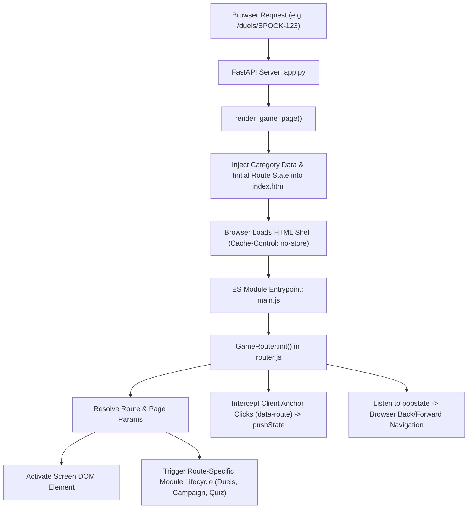
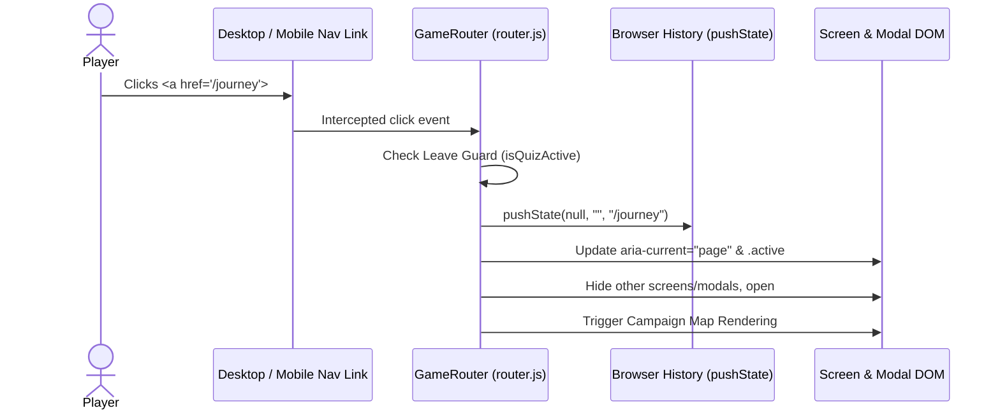
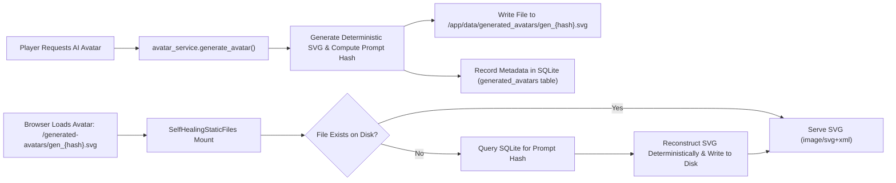

# Spooky Master v2.6 — Multi-Page Architecture & Production Reference

**Milestone**: Spooky Master v2.6 — Multi-Page Routed Experience, Persistent Generative Storage & Production Deployment Readiness
**Release Version**: `2.6.0`
**Current Commit**: `f07585bb2ad74aeb9aaade491804352b9b0002c3`
**Branch**: `main`
**Status**: Code Production Ready (Live Render Deployment: Not Yet Verified)

---

## 1. Purpose of Version 2.6.0

Spooky Master v2.6.0 transitions the frontend application from an unrouted single-page monolith into a **FastAPI-served multi-page/routed web application**. It pairs server-authoritative route endpoints with a client-side HTML5 History API router, establishes persistent storage for generative AI Hunter avatars on Render persistent disks, and delivers mobile-first dual-tier navigation shells while maintaining 100% backward compatibility and fair play guarantees.

### Core Objectives:
1. **True URL Routing**: Every major game surface possesses a distinct, bookmarkable, shareable URL.
2. **Browser Native Support**: Deep links, direct page refreshes, and browser Back/Forward (`popstate`) navigation function seamlessly.
3. **Leave Protection**: Active quiz sessions are shielded against accidental navigation or tab closure via leave guards.
4. **Persistent Avatar Assets**: Generated AI hunter SVGs persist across Docker container redeployments and restarts via Render persistent disk mounts and deterministic self-healing recovery.
5. **Mobile-First UX**: Responsive dual navigation architecture featuring a desktop header bar, compact mobile bottom navigation bar (`.mobile-bottom-nav`), and mobile drawer sheet.
6. **Production Deployment Hardening**: Verified container configuration, SQLite WAL mode, health check probes, and strict zero pay-to-win enforcement.

---

## 2. Multi-Page Route Architecture Overview

Spooky Master v2.6 uses a **hybrid server-rendered shell + client-side routing model**. FastAPI renders a single unified, lightweight HTML template (`templates/index.html`) with server-injected route metadata (`window.__INITIAL_ROUTE__`, `window.__INITIAL_PAGE__`, `window.__PAGE_PARAMS__`), after which the Vanilla JS client router (`static/js/modules/router.js`) mounts the appropriate screen and bootstraps module lifecycles.



---

## 3. Current Registered Routes

FastAPI exposes direct GET routes that render the game shell with pre-configured initial states:

| Route Path | Initial Page ID | Screen Element ID | Description |
| :--- | :--- | :--- | :--- |
| `/` | `home` | `#screen-start` | Haunted Game Lobby & Mode Select |
| `/play` | `play` | `#screen-start` (setup view) | Customized Hunt Configuration & Category Picker |
| `/play/session` | `quiz` | `#screen-quiz` | Active Trivia Session with HUD & Timers |
| `/results` | `results` | `#screen-results` | Final Game Session Breakdown & Star Rating |
| `/results/{session_id}` | `results` | `#screen-results` | Deep Link to Specific Past Quiz Result |
| `/journey` | `journey` | `#campaign-modal` | The Haunted Journey Campaign Map (6 Chapters) |
| `/journey/chapter/{chapter_id}` | `journey_chapter` | `#campaign-modal` | Direct Deep Link to Specific Campaign Chapter |
| `/daily-haunt` | `daily_haunt` | `#screen-start` (daily mode) | Global UTC-Seeded Daily Challenge & Community Haunt |
| `/duels` | `duels` | `#duels-modal` | Asynchronous PvP Duels Lobby & Challenge Creator |
| `/duels/{code}` | `duel_invite` | `#duels-modal` | Deep Link to Accept PvP Duel Challenge |
| `/duel/{code}` | `duel_invite` | `#duels-modal` | Short Alias for Duel Challenge Deep Link |
| `/progress` | `progress` | `#profile-modal` | Player Profile, Mastery Tiers & Badges Showcase |
| `/leaderboard` | `leaderboard` | `#leaderboard-modal` | Server-Authoritative Crypt High Scores |
| `/pass` | `pass` | `#monetization-modal` | Spooky Master Pass & Entitlements Showcase |
| `/settings` | `settings` | `#settings-modal` | Audio, Accessibility, Haptic & Data Preferences |
| `/hunters` | `hunters` | `#avatar-drawer` | Supernatural Hunter Guises Drawer |
| `/hunter-studio` | `hunter_studio` | `#avatar-studio-modal` | Generative AI Hunter Avatar Studio |
| `/privacy` | `privacy` | Template `/privacy.html` | Compliant Privacy Policy Document |

---

## 4. FastAPI Page Routing Implementation

All game routes are declared in `src/halloween_quiz/web/app.py` and handled by `render_game_page()`:

```python
def render_game_page(
    request: Request,
    page_name: str,
    page_title: str,
    page_params: dict | None = None,
) -> HTMLResponse:
    index_file = templates_dir / "index.html"
    category_json = json.dumps(request.app.state.question_bank.get_categories()).replace("</", "<\\/")
    params_json = json.dumps(page_params or {}).replace("</", "<\\/")
    page = index_file.read_text(encoding="utf-8")

    # Update HTML document title
    page = re.sub(r"<title>.*?</title>", f"<title>{page_title}</title>", page)
    # Inject live categories
    page = page.replace("__CATEGORY_DATA__", category_json)
    # Inject initial route bootstrap payload
    server_route_script = (
        f'<script id="server-route-data">\n'
        f'window.__INITIAL_ROUTE__ = "{request.url.path}";\n'
        f'window.__INITIAL_PAGE__ = "{page_name}";\n'
        f'window.__PAGE_PARAMS__ = {params_json};\n'
        f'</script>'
    )
    page = page.replace("<!-- SERVER_ROUTE_DATA -->", server_route_script)
    return HTMLResponse(page, headers={"Cache-Control": "no-store"})
```

### Key Technical Properties:
- **`Cache-Control: no-store`**: Server route responses prevent stale client browser history caches while allowing PWA service worker precaching.
- **XSS-Safe Injection**: Injected JSON strings escape closing script tags (`</` to `<\/`).

---

## 5. Client-Side Router (`router.js`)

Located at `src/halloween_quiz/web/static/js/modules/router.js`, `GameRouter` coordinates:
1. **Link Interception**: Intercepts standard `<a href="/...">` clicks, checks against registered route patterns, calls `event.preventDefault()`, and executes `navigate(path)`.
2. **History State Management**: Uses `window.history.pushState` and `window.history.replaceState` to update the browser address bar without full page reloads.
3. **Popstate Listener**: Listens to `window.addEventListener("popstate", ...)` to restore views when the user clicks the browser Back or Forward buttons.
4. **Active Navigation Indicator**: Toggles `aria-current="page"` and `.active` classes on all matching header, mobile bottom nav, and drawer anchors.



---

## 6. Route-Aware Lifecycle Initialization

When a route is loaded directly or navigated to client-side, `GameRouter` executes specific bootstrap hooks:

- **`/`**: Closes all open modals, reveals `#screen-start`, and refreshes the returning player identity card and diamond balance.
- **`/play`**: Reveals `#screen-start` and smoothly scrolls to the customized hunt configuration panel.
- **`/play/session`**: Validates an active `QuizSession`. If no quiz is running, safely redirects to `/play`.
- **`/results` & `/results/:sessionId`**: Populates the results screen from the session cache or queries the backend for session metrics.
- **`/journey` & `/journey/chapter/:chapterId`**: Opens `#campaign-modal` and focuses the target chapter map node.
- **`/duels` & `/duels/:duelCode`**: Opens `#duels-modal` and automatically populates the match join input with the URL challenge code.
- **`/progress`**: Opens `#profile-modal`, refreshing category mastery bars, stats grid, and badge showcase.
- **`/leaderboard`**: Opens `#leaderboard-modal` and triggers `/api/leaderboard` fetch.
- **`/pass`**: Opens `#monetization-modal` (Spooky Master Pass & Witch's Market).
- **`/settings`**: Opens `#settings-modal` with current audio and accessibility toggles.
- **`/hunters`**: Opens `#avatar-drawer` guise picker.
- **`/hunter-studio`**: Opens `#avatar-studio-modal` for AI hunter synthesis.

---

## 7. Shared Navigation Shell & Responsive Controls

The application UI employs a unified shell split into two responsive tiers:

### 1. Desktop Top Navigation Bar (`<header class="app-header">`):
- **Branding**: Clickable logo linking to `/`.
- **Diamond Wallet**: Tactile pill (`#btn-market-open`) showing current diamond balance and linking to Market/Pass.
- **Primary Links**: `🗺️ Journey` (`/journey`), `⚔️ Duels` (`/duels`), `🎃 Pass` (`/pass`), `📜 Progress` (`/progress`), `🏆 Leaderboard` (`/leaderboard`), and `⚙️ Settings` (`/settings`).
- **Install Button**: Dynamic `#btn-pwa-install` button displayed when `beforeinstallprompt` fires.

### 2. Mobile Bottom Navigation Bar (`<nav class="mobile-bottom-nav">`):
- Pinned to the bottom viewport on viewports `< 768px`.
- Fixed height: 56px, high z-index (`z-index: 100`), dark acrylic backdrop (`backdrop-filter: blur(12px)`).
- Items:
  - 🏠 **Home** (`/`)
  - 🗺️ **Journey** (`/journey`)
  - ⚔️ **Duels** (`/duels`)
  - 📜 **Progress** (`/progress`)
  - ☰ **More** (triggers `#mobile-more-sheet`)
- Safe area inset padding (`env(safe-area-inset-bottom)`) for modern mobile notches and gesture bars.

### 3. Mobile "More" Drawer Sheet (`#mobile-more-sheet`):
- Slides up from the bottom of the screen upon tapping the "More" button.
- Contains secondary navigation targets: Leaderboard (`/leaderboard`), Pass (`/pass`), Hunter Studio (`/hunter-studio`), Settings (`/settings`), Privacy Policy (`/privacy`), and PWA Install.

---

## 8. Deep Links & Direct URL Refresh Support

Spooky Master v2.6 supports direct URL entry, bookmarking, and link sharing:
- When a user refreshes or pastes `https://halloween.jamoloto.dev/duels/SPOOK-99`, the server catches the route, injects `window.__PAGE_PARAMS__ = { duelCode: "SPOOK-99" }`, and returns the HTML shell.
- The client-side router parses the parameter, reveals the duels modal, and pre-populates the challenge code.
- If the user uses browser Back, the router switches back to the previous screen without contacting the server.

---

## 9. Active Quiz Leave Guard

To prevent accidental loss of active gameplay progress:
1. **In-App Navigation Guard**: When `app.isQuizActive()` returns `true`, any attempt to navigate to another route triggers a confirmation prompt (`"Leave this hunt? Your current round will be abandoned."`). If declined, navigation is aborted.
2. **Browser Tab / Window Close Guard**: A `beforeunload` event handler is registered:
   ```javascript
   window.addEventListener("beforeunload", (e) => {
       if (this.app.isQuizActive && this.app.isQuizActive()) {
           e.preventDefault();
           e.returnValue = "Leave this hunt? Your current round will be abandoned.";
           return e.returnValue;
       }
   });
   ```

---

## 10. PWA Route Caching & Offline Support

Spooky Master's Progressive Web App runtime is managed by `/sw.js`:
- **Cache Key**: `spooky-master-v2.6.0`
- **Precaching Strategy**: Explicit precache list contains all application routes (`/`, `/play`, `/play/session`, `/results`, `/journey`, `/daily-haunt`, `/duels`, `/progress`, `/leaderboard`, `/pass`, `/settings`, `/hunters`, `/hunter-studio`, `/offline.html`, `/privacy`) and versioned ES modules.
- **Navigation Requests**: Uses a **Network-First** strategy for navigation requests. If the network is unavailable, it returns the cached route shell; if the route is un-cached, it serves `/offline.html`.
- **Cache Invalidation**: On `activate`, the service worker deletes any cache whose key does not match `spooky-master-v2.6.0`.

---

## 11. Generated Avatar Architecture & Persistence

### Historical Issue & Resolution:
- **Pre-v2.6 Architecture**: Synthesized avatars were saved to `src/halloween_quiz/web/static/avatars/generated/`. In Docker/Render container deployments, this directory was ephemeral; every redeployment or restart wiped generated avatars, causing broken 404 images for players.
- **v2.6 Architecture**:
  - Development Directory: `data/generated_avatars`
  - Production Directory: `/app/data/generated_avatars`
  - Controlled by environment variable: `GENERATED_AVATAR_DIR`
  - Mounted on persistent disk storage (`/app/data`) in Render.
  - Public HTTP endpoint: `/generated-avatars/<file>.svg`



### Self-Healing & Safety Guarantees:
1. **Self-Healing Static Files (`SelfHealingStaticFiles`)**: If an SVG asset is unexpectedly missing on disk (e.g. disk migration or cleanup), the mount intercepts the 404, looks up the prompt hash in the SQLite database, reconstructs the SVG deterministically using `avatar_service.ensure_avatar_asset(cached)`, writes it back to disk, and serves it with HTTP 200.
2. **Legacy Route Support**: Legacy requests to `/static/avatars/generated/{filename}` are routed through a compatibility handler with identical self-healing and path traversal protection.
3. **Security Protections**: Filenames are strictly validated against `^[a-zA-Z0-9_-]+\.svg$`. Path traversal (`..`) attempts are blocked and return HTTP 400. Generated SVG content is strictly application-controlled vector markup.

---

## 12. Database & Production Storage Architecture

### Production Storage Layout:
```
/app/data/                           <-- Mounted Render Persistent Disk (1 GB)
├── halloween.db                     <-- SQLite production database file
├── halloween.db-wal                 <-- SQLite Write-Ahead Log
├── halloween.db-shm                 <-- SQLite Shared Memory index
└── generated_avatars/               <-- Persistent SVG asset storage
    ├── gen_3a7b9c1d...svg
    └── ...
```

### Persistence Configuration:
- **`DATABASE_PATH`**: `/app/data/halloween.db`
- **`DATABASE_URL`**: `sqlite:////app/data/halloween.db`
- **`GENERATED_AVATAR_DIR`**: `/app/data/generated_avatars`
- **SQLite WAL Mode**: Enabled automatically on connection initialization (`PRAGMA journal_mode=WAL; PRAGMA synchronous=NORMAL; PRAGMA foreign_keys=ON;`). Provides high concurrency between web worker read requests and quiz write transactions.
- **PostgreSQL Compatibility**: SQLAlchemy storage abstraction supports PostgreSQL connection strings if external DB clusters are attached in the future. PostgreSQL is not required for current production operation.

---

## 13. Production Docker Architecture

Spooky Master uses a hardened multi-stage Docker build:

```dockerfile
# Multi-stage container build
FROM python:3.12-slim AS builder
WORKDIR /app
COPY requirements.txt .
RUN pip install --no-cache-dir --prefix=/install -r requirements.txt

FROM python:3.12-slim
WORKDIR /app
COPY --from=builder /install /usr/local
COPY . /app
RUN pip install --no-cache-dir -e .

# Security: Non-root execution
RUN groupadd -r spooky && useradd -r -g spooky spooky && \
    mkdir -p /app/data/generated_avatars && chown -R spooky:spooky /app/data
USER spooky

EXPOSE 5000
CMD ["uvicorn", "halloween_quiz.web.app:app", "--host", "0.0.0.0", "--port", "5000"]
```

### Key Security & Operational Aspects:
- **Non-Root Execution**: Runs as non-root user `spooky`.
- **Pre-Created Mount Points**: `/app/data/generated_avatars` is provisioned with proper user permissions.
- **Port Flexibility**: Binds to `$PORT` (default 5000) for standard cloud container platforms.

---

## 14. Verification & Testing State

The v2.6.0 architecture is validated by automated regression suites:

| Suite | Scope | Status | Notes |
| :--- | :--- | :--- | :--- |
| **Python Unit & Integration** | 131 tests | 🟢 131 passed, 0 failed, 3 skipped | Covers engine, models, campaign, duels, hints, avatars, storage, routes, and anti-cheat |
| **Playwright Browser E2E** | 53 tests | 🟢 53 passed, 0 failed | Validates core gameplay, desktop/mobile navigation, modals, theme switcher, and multi-page routing |
| **Ruff Linter** | Entire codebase | 🟢 PASS | 0 errors |
| **Mypy Static Type Checker** | 20 source files | 🟢 PASS | 0 errors (strict typing) |
| **GitHub Actions CI** | Python 3.10, 3.11, 3.12 | 🟢 GREEN | Multi-version Python compatibility and browser testing |
| **Docker / GHCR** | Container build & push | 🟢 GREEN | Multi-stage image build and package publishing |

---

## 15. Production Deployment Readiness

Documentation maintains strict operational honesty:
- **Code & Container Readiness**: **READY FOR PRODUCTION**
- **Render Live Deployment**: **NOT YET VERIFIED** (automatic deployment API trigger was skipped because API secrets are not configured in GitHub repository settings)
- **Configured Target Domain**: `https://halloween.jamoloto.dev` (**NOT YET VERIFIED** in live DNS)
- **Real-Money Monetization**: **NOT IMPLEMENTED** (100% Policy A zero pay-to-win, simulated payment architecture)
